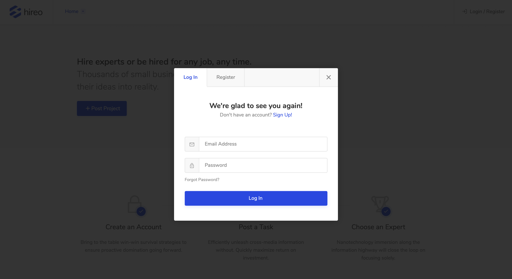

# Freelancing Platform Website
A website which allows freelancers to find jobs that are posted by employers. The logic is as following: both employer and freelancer register to the website. Employer can post jobs and determine its budget range to which freelancers can bid. Employers can see the project bids and decide who they want to hire. When hireing a freelancer, employer has to pay a deposit fee which is defined in the admin panel (e.g. 20%). Upon job completion the employer pays the remaining price for the job completion. 

## Duration
- 22.12.2019. - 31.1.2020.

## Technologies used
- HTML
- CSS
- PHP
- MySQL
- Bootstrap Framework

## Features

- login and registration, two account types (employers and freelancers), each having their own views
- freelancers can edit their profile - add "about me" text, choose occupation (e.g. Web Development), skills (e.g. PHP, JavaScript, HTML), country and location
- employers can list and filter all freelancers and view their profiles
- employers can post jobs (they have to fill in the project description, budget range, category, required skills etc.)
- freelancers can bid to projects
- employers can see bidders for each project and choose which freelancer they want to hire
- email notifications for employers: when someone has bid on their project, when freelancer has given them a rating etc.
- email notifications for freelancers: when a new job meeting their occupation and skills has been posted, when they get hired, when they get paid etc.
- website fee system - for each job, the website owner gets a fee percantage which can be defined in the admin panel
- admin panel where admins can change the deposit fee and website fee. I
- it is possible in the admin panel to choose who will be the one paying the website fee (freelancer or employer)
- categories and skills can be added or modified in the admin panel
- SMTP information for sending email notifications can be edited in the admin panel

## Client's Feedback

 
## Screenshots

*Website index page*

*Login modal*

*Register modal*

*Employer - dashboard*

*Freelancer - dashboard*

*Employer - posting a new job*

*Freelancer - listing through job posts*

*Freelancer - job filters*
